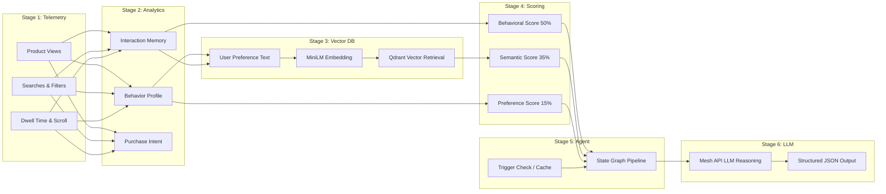
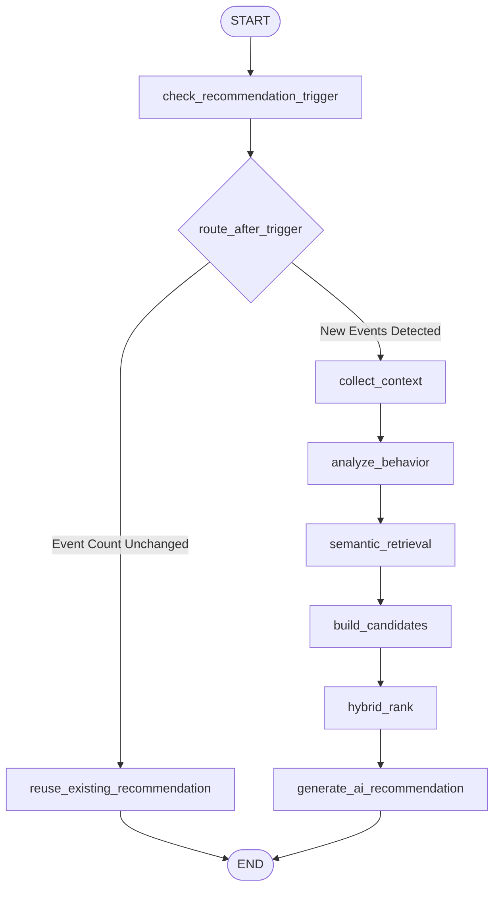

# 📊 SmartReco Feature Report & Recommendation System Deep Dive

> [!IMPORTANT]
> **Executive Overview**  
> SmartReco is an enterprise-grade AI recommendation engine for online learning platforms. It bridges raw behavioral telemetry with high-dimensional vector search, multi-factor scoring algorithms, stateful agentic graph workflows, and Large Language Model (LLM) natural language reasoning.

---

## 📑 Feature Inventory & Engineering Accomplishments

Below is the complete audit of features engineered across all layers of the SmartReco platform:

| Module / Component | Feature Description | Core Implementation Files | Status |
| :--- | :--- | :--- | :---: |
| **Telemetry & Ingestion** | Real-time event tracking (`PRODUCT_VIEW`, `SEARCH`, `FILTER`, `TIME_SPENT`, `SCROLL_DEPTH`) | [event_service.py](file:///c:/Users/user/OneDrive/Desktop/SmartReco/app/services/event_service.py), [event_router.py](file:///c:/Users/user/OneDrive/Desktop/SmartReco/app/routers/event_router.py) | ✅ Operational |
| **Interaction Memory** | Aggregated per-user product interaction records with exponential recency decay ($e^{-0.10 \times t}$) | [product_interaction_service.py](file:///c:/Users/user/OneDrive/Desktop/SmartReco/app/services/product_interaction_service.py) | ✅ Operational |
| **Behavior Profiling** | Learned user affinities (category, difficulty, language) & non-linear purchase intent calculation | [behavior_profile_service.py](file:///c:/Users/user/OneDrive/Desktop/SmartReco/app/services/behavior_profile_service.py) | ✅ Operational |
| **Vector DB & Search** | Product catalog embedding (`all-MiniLM-L6-v2`) & sub-millisecond Qdrant similarity retrieval | [qdrant_service.py](file:///c:/Users/user/OneDrive/Desktop/SmartReco/app/services/qdrant_service.py), [embedding_service.py](file:///c:/Users/user/OneDrive/Desktop/SmartReco/app/services/embedding_service.py) | ✅ Operational |
| **User Preference Vector** | Dynamic natural language synthesis of user intent into high-dimensional vector query embeddings | [user_embedding_service.py](file:///c:/Users/user/OneDrive/Desktop/SmartReco/app/services/user_embedding_service.py), [semantic_retrieval_service.py](file:///c:/Users/user/OneDrive/Desktop/SmartReco/app/services/semantic_retrieval_service.py) | ✅ Operational |
| **Hybrid Ranking Engine** | 3-tier hybrid scoring algorithm balancing behavioral signals (50%), semantic similarity (35%), and preference match (15%) | [hybrid_ranking_service.py](file:///c:/Users/user/OneDrive/Desktop/SmartReco/app/services/hybrid_ranking_service.py) | ✅ Operational |
| **Agentic Workflow** | Stateful graph orchestration with condition-based trigger checks and recommendation reuse | [recommendation_agent_v2.py](file:///c:/Users/user/OneDrive/Desktop/SmartReco/app/agents/recommendation_agent_v2.py) | ✅ Operational |
| **LLM Reasoning Layer** | Mesh API integration (`tencent/hy3` model) generating JSON recommendations with personalized rationales | [mesh_llm_service.py](file:///c:/Users/user/OneDrive/Desktop/SmartReco/app/services/mesh_llm_service.py), [recommendation_generation_service.py](file:///c:/Users/user/OneDrive/Desktop/SmartReco/app/services/recommendation_generation_service.py) | ✅ Operational |
| **Authentication & Auth** | Secure JWT authentication flow, password hashing (bcrypt), and role-based route security | [auth_service.py](file:///c:/Users/user/OneDrive/Desktop/SmartReco/app/services/auth_service.py), [auth_router.py](file:///c:/Users/user/OneDrive/Desktop/SmartReco/app/routers/auth_router.py) | ✅ Operational |
| **Admin Operations** | Dashboard for monitoring active users, triggering batch product re-indexing, and profile recalculations | [admin_router.py](file:///c:/Users/user/OneDrive/Desktop/SmartReco/app/routers/admin_router.py) | ✅ Operational |
| **Web Interface** | Modern SSR web application built with FastAPI, Jinja2 Templates, and custom dark/light UI styling | [main.py](file:///c:/Users/user/OneDrive/Desktop/SmartReco/app/main.py), `app/templates/` | ✅ Operational |

---

## 🎯 Deep Dive: How the Recommendation System Works

The recommendation system in SmartReco operates through a **6-Stage Recommendation Pipeline**.



---

### Stage 1: Behavioral Telemetry Ingestion

Whenever a user interacts with the catalog, micro-events are pushed to `/events`.

* **`PRODUCT_VIEW`**: Fires when a product detail page is viewed.
* **`SEARCH`**: Captures explicit user search strings.
* **`FILTER`**: Captures applied facets (e.g. difficulty = `Intermediate`, language = `Python`).
* **`TIME_SPENT`**: Records active session seconds spent reading product material.
* **`SCROLL_DEPTH`**: Captures scroll percentages up to $100\%$.

---

### Stage 2: Interaction Memory & Behavior Profile Calculation

#### 1. Interaction Memory Score
Aggregates activity per product and applies a logarithmic saturation curve to prevent high-frequency view spam from dominating scoring:

$$\text{ViewScore} = \min\left(\frac{\ln(1 + \text{views})}{\ln(1 + 20)}, 1.0\right)$$

$$\text{TimeScore} = \min\left(\frac{\text{seconds}}{300}, 1.0\right)$$

$$\text{ScrollScore} = \min\left(\frac{\text{depth}}{100}, 1.0\right)$$

$$\text{SearchScore} = \min\left(\frac{\text{searches}}{5}, 1.0\right)$$

$$\text{InteractionScore} = 0.30 \cdot \text{ViewScore} + 0.30 \cdot \text{TimeScore} + 0.25 \cdot \text{ScrollScore} + 0.15 \cdot \text{SearchScore}$$

#### 2. Recency Decay
To ensure user interest changes are reflected immediately, an exponential decay function is applied:

`RecencyScore = e^(-0.10 * age_days)`

$$\text{Final Behavioral Score} = \text{InteractionScore} \times \text{RecencyScore}$$

> [!NOTE]
> An interaction from 7 days ago retains $\approx 49.6\%$ of its original weight, while an interaction from 30 days ago decays to $\approx 4.9\%$.

#### 3. Purchase Intent Modeling
Calculated using non-linear asymptotic saturation:

$$\text{PurchaseIntent} = 1 - e^{-\text{RawIntent}}$$

Where high engagement signals (dwell time $\ge 60\text{s}$, scroll depth $\ge 75\%$) contribute disproportionately to commercial intent.

---

### Stage 3: Semantic Vector Retrieval (Qdrant + SentenceTransformers)

1. **Product Embeddings**: Products are embedded into a 384-dimensional dense vector space using `SentenceTransformers` (`all-MiniLM-L6-v2`) based on title, description, category, difficulty, language, skills, and tags. The vectors are stored in Qdrant.
2. **User Preference Embedding**: The system dynamically builds a user profile narrative string:
   ```text
   Interested categories: Machine Learning, Data Science
   Preferred difficulty levels: Intermediate, Advanced
   Preferred languages: Python, English
   Search frequency: 12
   Average time spent: 145.0 seconds
   Average scroll depth: 82.0%
   Purchase intent: 0.742
   Previously explored products: PyTorch Masterclass, Neural Networks Architecture
   ```
3. **Similarity Search**: The user preference text is encoded into the same vector space and sent to Qdrant, retrieving top matching products via cosine similarity search.

---

### Stage 4: 3-Tier Hybrid Ranking Algorithm

Candidate items are ranked using a weighted combination of three distinct signals:

$$\text{HybridScore} = 0.50 \times S_{\text{behavioral}} + 0.35 \times S_{\text{semantic}} + 0.15 \times S_{\text{preference}}$$

#### Three-Tier Behavioral Resolution Strategy

> [!TIP]
> Cold-start items (products vector-retrieved that the user has never interacted with) are handled gracefully without collapsing their score to zero.

* **Tier 1 (Direct Record with Precomputed Score)**: Uses the precomputed `final_score` directly from `product_interactions`.
* **Tier 2 (Direct Record Pending Calculation)**: Re-calculates raw metric score on-the-fly and applies recency decay.
* **Tier 3 (Cold-Start Fallback)**: Assigns $50\%$ of the user's category engagement score from their `behavior_profile` as a baseline score:
  $$S_{\text{behavioral (cold)}} = 0.50 \times \text{CategoryScore}(\text{product.category})$$

---

### Stage 5: Stateful LangGraph Agentic Pipeline (`recommendation_agent_v2`)

The recommendation pipeline runs inside a **LangGraph StateGraph**:



#### Graph Node Responsibilities
1. **`check_recommendation_trigger`**: Queries total user event count vs. historical state to determine if recalculation is needed.
2. **`collect_context`**: Pulls user profile, interaction memory, and recent product context from PostgreSQL.
3. **`analyze_behavior`**: Formats top categories, difficulties, languages, and purchase intent metrics into structured state.
4. **`semantic_retrieval`**: Encodes dynamic user preference text and queries Qdrant.
5. **`build_candidates`**: Merges Qdrant vector hits with relational product rows.
6. **`hybrid_rank`**: Applies 3-tier scoring and sorts candidate items.
7. **`generate_ai_recommendation`**: Formats top ranked candidates and submits them to the LLM.

---

### Stage 6: LLM Reasoning & Response Validation

The highest-ranked products are formatted into a prompt for the **Mesh API LLM (`tencent/hy3` model)** to synthesize natural language explanations.

#### System Prompt Directives
* Must recommend ONLY a valid candidate from the provided list.
* Must enforce JSON schema without markdown codeblocks:
  ```json
  {
      "product_id": 14,
      "title": "Advanced Deep Learning with PyTorch",
      "reason": "Matches your high engagement in Machine Learning (82% avg scroll depth) and interest in PyTorch.",
      "confidence": 0.945
  }
  ```
* Output product ID is cross-validated against PostgreSQL primary keys to eliminate hallucinations.

---

## 🧪 Verification & Empirical Testing Results

All core services are backed by unit and integration tests:

| Test Suite | Purpose | Key Assertions Verified | Status |
| :--- | :--- | :--- | :---: |
| [test_hybrid_ranking.py](file:///c:/Users/user/OneDrive/Desktop/SmartReco/tests/test_hybrid_ranking.py) | Validates scoring weight distribution | Verifies $50/35/15$ ratio & Tier 3 cold-start fallback | PASSED |
| [test_qdrant_search.py](file:///c:/Users/user/OneDrive/Desktop/SmartReco/tests/test_qdrant_search.py) | Tests vector DB storage & retrieval | Verifies 384-dim embedding indexing & cosine query results | PASSED |
| [test_agent_v2.py](file:///c:/Users/user/OneDrive/Desktop/SmartReco/test_agent_v2.py) | Tests LangGraph Agent execution | Verifies graph branching between `reuse` and `generate` | PASSED |
| [test_event_service.py](file:///c:/Users/user/OneDrive/Desktop/SmartReco/tests/test_event_service.py) | Real-time event ingestion & profile updates | Confirms automatic update of user behavior profile upon event | PASSED |
| [test_user_embedding.py](file:///c:/Users/user/OneDrive/Desktop/SmartReco/tests/test_user_embedding.py) | Tests dynamic user vector synthesis | Validates text generation and SentenceTransformers vector encoding | PASSED |

---

## 💡 Summary of System Capabilities

1. **Real-Time Responsiveness**: Every user click, scroll, and search dynamically updates their profile and interaction scores.
2. **Cold-Start Resilience**: New users and unviewed products maintain non-zero baseline scores via preference decay and vector similarity.
3. **Agentic Efficiency**: Caches recommendation outputs when no new user activity has occurred, conserving vector and LLM compute.
4. **Explainable AI**: Accompanies numeric scores with human-readable rationale generated by LLM reasoning.
